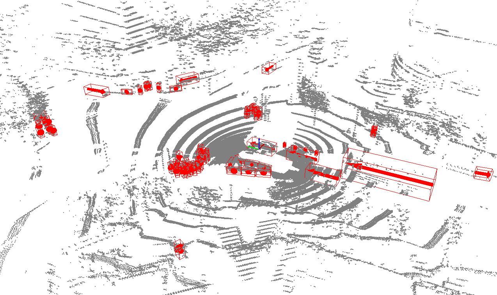

# CUDA-CenterPoint
This repository contains sources and model for [CenterPoint](https://arxiv.org/abs/2006.11275) inference using CUDA & TensorRT.


Overall inference has following phases:
- Voxelization with CUDA kernel
- 3D backbone with NV spconv-scn
- RPN & CenterHead with TensorRT
- Decode & NMS with CUDA kernel

## Model && Data
This demo uses lidar data from [nuScenes Dataset](https://www.nuscenes.org/).
Onnx model can be converted from checkpoint and config below using given script.
|  Dataset  |  Checkpoint  | Config |
| --------- | ------------ | ------ |
|  nuScenes | [epoch_20.pth](https://mitprod-my.sharepoint.com/:f:/g/personal/tianweiy_mit_edu/EhgzjwV2EghOnHFKyRgSadoBr2kUo7yPu52N-I3dG3c5dA?e=a9MdhX) | [nusc_centerpoint_voxelnet_0075voxel_fix_bn_z](https://github.com/tianweiy/CenterPoint/blob/master/configs/nusc/voxelnet/nusc_centerpoint_voxelnet_0075voxel_fix_bn_z.py) |

### Prerequisites

To build the centerpoint inference, **CUDA**, **TensorRT** and **[libspconv](/libraries/3DSparseConvolution)** libraries are needed.
Note that libspconv only supports sm_80 & sm_86 on Tesla Platform and sm_87 on Embedded Platform.

## Environments

Tesla Platform
- Ubuntu20.04 x86_64 with Nvidia Tesla A30
- CUDA 11.4 + cuDNN 8.4.1 + TensorRT 8.4.12.5

Embedded Platform
- Nvidia Drive Orin 6.0.3.0
- CUDA 11.4 + cuDNN 8.3.3 + TensorRT 8.4.10.4

### Compile && Run

Run detection process on test data.
```shell
$ cd CUDA-CenterPoint
$ bash tool/build.trt.sh
$ mkdir -p build && cd build
$ cmake .. && make -j
$ ./centerpoint ../data/test/ --verbose

GPU has cuda devices: 1
----device id: 0 info----
  GPU : Orin 
  Capbility: 8.7
  Global memory: 28458MB
  Const memory: 64KB
  SM in a block: 48KB
  warp size: 32
  threads in a block: 1024
  block dim: (1024,1024,64)
  grid dim: (2147483647,65535,65535)

Total 2

<<<<<<<<<<<
load file: ../data/test/3615d82e7e8546fea5f181157f42e30b.bin
find points num: 267057
[TIME] Voxelization:            1.45373 ms
valid_num: 106004
[TIME] 3D Backbone:             28.46256 ms
[TIME] RPN + Head:              12.02893 ms
[TIME] Decode + NMS:            3.14230 ms
Detection NUM: 55
Saved prediction in: ../data/prediction/3615d82e7e8546fea5f181157f42e30b.txt
>>>>>>>>>>>

<<<<<<<<<<<
load file: ../data/test/291e7331922541cea98122b607d24831.bin
find points num: 239911
[TIME] Voxelization:            1.26243 ms
valid_num: 85179
[TIME] 3D Backbone:             22.59728 ms
[TIME] RPN + Head:              10.75770 ms
[TIME] Decode + NMS:            4.77162 ms
Detection NUM: 171
Saved prediction in: ../data/prediction/291e7331922541cea98122b607d24831.txt
>>>>>>>>>>>

Perf Report: 
    Voxelization: 1.35808 ms.
    3D Backbone: 25.5299 ms.
    RPN + Head: 11.3933 ms.
    Decode + NMS: 3.95696 ms.
    Total: 42.2383 ms.
```

### FP16 Performance on A30 and Orin 

3D detection performance using the nuScenes validation dataset.
|   Impl    | 3D Backbone | Platform  | Precision |  mAP  |  NDS  |  FPS  | 
| --------- | ----------- | --------- | --------- | ----- | ----- | ----- |
| Torch-CP  | VoxelNet    |   A30     | FP32      | 59.55 | 66.75 |  3    |
| Torch-CP  | PointPillar | TITAN RTX | FP32+FP16 | 50.3  | 60.2  |  31   |
|  CUDA-CP  | VoxelNet    |   A30     | FP32+FP16 | 57.55 | 65.63 |  47   |
|  CUDA-CP  | VoxelNet    |   Orin    | FP32+FP16 | 57.57 | 65.64 |  23   |

Average perf on A30 and Orin using the nuScenes validation dataset.
| Unit : ms       | Precision  | A30       | Orin      |
| --------------- | ---------- | --------- | --------- |
| Voxelization    | FP32       | -         | 1.36       |
| 3D Backbone     | FP16       | 9.8       | 22.3      |
| RPN + Head      | FP16/INT8  | 3.8/2.5   | 11.3/7.0  |
| Decode + NMS    | FP16       | 3.1       | 4.4       |
| Total           | MIXED      | 21.3/20.0 | 40.0/35.7 |

### Visualize Inference Result


### Evaluate Inference Result

Organize folder structure as below to evaluate on nuScenes validation dataset.
```
CUDA-CenterPoint/
    data/
        eval/
        nusc_bin/
            291e7331922541cea98122b607d24831.bin            <-- 6019 bins
            ... ...
        nuScenes/
            gt_database_10sweeps_withvelo/                  <-- GT database 
            maps/                                           <-- unused
            samples/                                        <-- key frames
            sweeps/                                         <-- frames without annotation
            v1.0-test/                                      <-- metadata and annotations of test dataset
            v1.0-trainval/                                  <-- metadata and annotations of trainval dataset
            dbinfos_train_10sweeps_withvelo.pkl             <-- GT database info files
            infos_train_10sweeps_withvelo_filter_True.pkl   <-- train annotations
            infos_val_10sweeps_withvelo_filter_True.pkl     <-- val annotations
        pkl/
        prediction/
            291e7331922541cea98122b607d24831.txt            <-- prediction results
            ... ...
        test/
            291e7331922541cea98122b607d24831.bin            <-- test bin
            3615d82e7e8546fea5f181157f42e30b.bin            <-- test bin
    tool/
        checkpoint/
            epoch_20.pth                                    <-- checkpoint
```

Use given script under "./tool" to export bin files, run inference, then evaluate 3D detection performance.
```
$ python tool/eval_nusc.py --dump
$ cd build && ./centerpoint_infer ../data/nusc_bin/
$ python tool/eval_nusc.py --eval
```

## Know Issues
- When we use Voxelization+SCN+RPN+Postprocess pipeline under CUDA and PyTorchNMS, we can get 59.55 mAP and 66.76 NDS.
- But when we replace PyTorchNMS to CUDANMS, the mAP will be reduced to 57.6 and the NDS will be reduced to 65.66

## References
- [Center-based 3D Object Detection and Tracking](https://arxiv.org/abs/2006.11275)
- [CenterPoint Repository](https://github.com/tianweiy/CenterPoint)