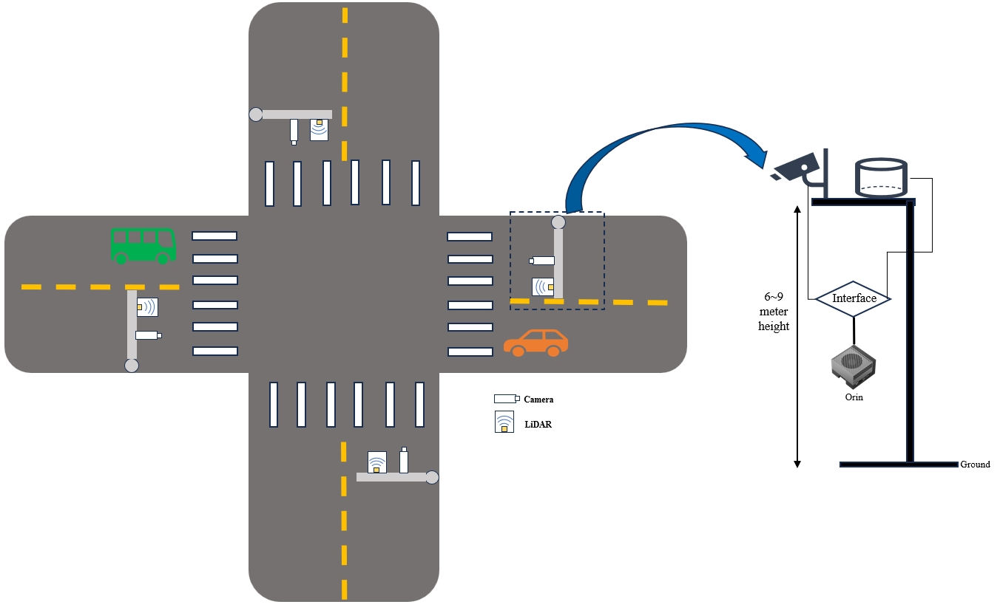
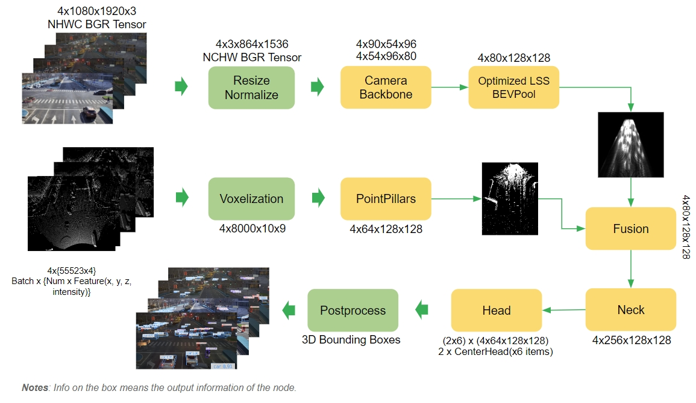

# V2XFusion
V2XFusion is a multi-sensor fusion 3D object detection solution for roadside scenarios. Utilizing the relative concentration of object heights in the roadside scenarios and the more information brought by multi-sensor fusion, V2XFusion achieved a good performance on the DAIR-V2X-I Dataset. This repository contains training, quantization, and ONNX exportation for V2XFusion. The pictures below show the camera and LiDAR installation locations and the characteristics of the roadside scenarios.


## Architecture


The architecture image takes batch size of 4 as an example. The data input of each batch consists of a camera data and the corresponding lidar data.

## Git clone and apply patch 
Please pull the specified version of BEVFusion and copy our patch package into it.

```bash
git clone https://github.com/mit-han-lab/bevfusion
cd bevfusion
git checkout db75150717a9462cb60241e36ba28d65f6908607
cd ..

git clone https://github.com/ADLab-AutoDrive/BEVHeight.git
cd BEVHeight
cp -r evaluators ../bevfusion/
cp -r scripts ../bevfusion/
cd ..

cp -r Lidar_AI_Solution/CUDA-V2XFusion/* bevfusion/ 
```
## Prerequisites
- [Installation guide](docs/install.md)

## Quick Start 
### 1. Prepare Dataset
Convert the dataset format from DAIR-V2X-I to KITTI. Please refer to this [document](https://github.com/ADLab-AutoDrive/BEVHeight/blob/main/docs/prepare_dataset.md) provided by BEVHeight.

### 2. Configure dataset paths
Set the dataset_root and dataset_kitti_root in the [configs/V2X-I/default.yaml](configs/V2X-I/default.yaml) to the paths where DAIR-V2X-I and DAIR-V2X-I-KITTI are located.

### 3. Training and PTQ
We have two training mechanisms, including sparsity training (2:4 structured sparsity) and dense training. The 2:4 structured sparsity can usually yield significant performance improvement on GPU that supports sparsity. This is an acceleration technique supported by hardware that we recommended.

**For sparsity training and PTQ:**
- Training
    ```bash
   $ torchpack dist-run -np 8 python scripts/train.py configs/V2X-I/det/centerhead/lssfpn/camera+pointpillar/resnet34/default.yaml --mode sparsity
    ```
- PTQ
    ```bash
   $ python scripts/ptq_v2xfusion.py configs/V2X-I/det/centerhead/lssfpn/camera+pointpillar/resnet34/default.yaml sparsity_epoch_100.pth --mode sparsity
    ```
**For dense training and PTQ**
- Training
    ```bash
   $ torchpack dist-run -np 8 python scripts/train.py configs/V2X-I/det/centerhead/lssfpn/camera+pointpillar/resnet34/default.yaml --mode dense
    ```
- PTQ
    ```bash
   $ python scripts/ptq_v2xfusion.py configs/V2X-I/det/centerhead/lssfpn/camera+pointpillar/resnet34/default.yaml dense_epoch_100.pth --mode dense
    ```

### 4. Export ONNX 
We have two export configurations available: FP16 (--precision fp16) and INT8 (--precision int8).
FP16 configuration provides sub-optimal TensorRT performance but the best prediction accuracy when compared to INT8. There are no QDQ nodes in the exported ONNX file.
INT8 configuration provides optimal TensorRT performance but sub-optimal prediction accuracy when compared to FP16. In this configuration, quantization parameters are present as QDQ nodes in the exported ONNX file.

To standardize the export of quantized and non-quantized models, trained models must first be PTQ, then are exported in FP16 and INT8 formats.

- FP16    
    ```bash
    $ python scripts/export_v2xfusion.py configs/V2X-I/det/centerhead/lssfpn/camera+pointpillar/resnet34/default.yaml ptq.pth --precision fp16
    ```
- INT8
    ```bash
    $ python scripts/export_v2xfusion.py configs/V2X-I/det/centerhead/lssfpn/camera+pointpillar/resnet34/default.yaml ptq.pth --precision int8
    ```
### 5. Deployment on DeepStream
Please refer to the V2XFusion inference sample provided by [DeepStream](https://docs.nvidia.com/metropolis/deepstream/dev-guide/text/DS_3D_Custom_Manual.html). The configuration parameters can be adjusted during training to adapt to different datasets, especially the **dbound** parameter. Before inference, you need to confirm that the parameters in the precomputation script in DeepStream are the same with the training setup.
```bash
image_size = [864, 1536]
downsample_factor = 16
C = 80 
xbound = [0, 102.4, 0.8]
ybound = [-51.2, 51.2, 0.8]
zbound = [-5, 3, 8]
dbound = [-2, 0, 90]   
```
## Experimental Results
- DAIR-V2X-I Dataset  

    <div align=left>
    <table>
        <tr align=center>
            <td rowspan="3">Method</td> 
            <td rowspan="3" align=center>Sparsity/Dense</td> 
            <td rowspan="3" align=center>FP16/INT8</td> 
            <td colspan="3" align=center>Car</td>
            <td colspan="3" align=center>Pedestrain</td>
            <td colspan="3" align=center>Cyclist</td>
            <td rowspan="3" align=center>model pth</td>
        </tr>
        <tr align=center>
            <td colspan="3" align=center>3D@0.5</td>
            <td colspan="3" align=center>3D@0.25</td>
            <td colspan="3" align=center>3D@0.25</td>
        </tr>
        <tr align=center>
            <td>Easy</td>
            <td>Mod.</td>
            <td>Hard</td>
            <td>Easy</td>
            <td>Mod.</td>
            <td>Hard</td>
            <td>Easy</td>
            <td>Mod.</td>
            <td>Hard</td>
        </tr>
        <tr align=center>
            <td rowspan="4">V2XFusion</td> 
            <td>sparsity</td>
            <td>FP16</td> 
            <td>82.08</td>
            <td>69.70</td>
            <td>69.76</td>
            <td>51.51</td>
            <td>49.15</td>
            <td>49.54</td>
            <td>61.21</td>
            <td>58.07</td>
            <td>58.65</td>
            <td><a href="https://nvidia.box.com/shared/static/gakymhr1e0wc17s7ksswa7409nfhg6zn">model</a></td>
        </tr>
        <tr align=center>
            <td>sparsity</td>
            <td>INT8-PTQ</td> 
            <td>82.06</td>
            <td>69.70</td>
            <td>69.75</td>
            <td>51.13</td>
            <td>48.86</td>
            <td>49.22</td>
            <td>60.95</td>
            <td>57.81</td>
            <td>58.43</td>
            <td>/</td>
        </tr>
        <tr align=center>
            <td>Dense</td>
            <td>FP16</td> 
            <td>82.30</td>
            <td>69.84</td>
            <td>69.90</td>
            <td>49.47</td>
            <td>47.31</td>
            <td>47.60</td>
            <td>59.09</td>
            <td>58.29</td>
            <td>58.70</td>
            <td><a href="https://nvidia.box.com/shared/static/o5u4tryaeasgu5k0q92106h9wcyn0t7n">model</a></td>
        </tr>
        <tr align=center>
            <td>Dense</td>
            <td>INT8-PTQ</td> 
            <td>82.33</td>
            <td>69.88</td>
            <td>69.94</td>
            <td>48.60</td>
            <td>46.55</td>
            <td>46.82</td>
            <td>59.28</td>
            <td>58.12</td>
            <td>58.52</td>
            <td>/</td>
        </tr>
    <table>
    </div>
V2XFusion Backbone: **ResNet34 + PointPillars**

Note:  
To make the model more robust, the sequence dataset V2X-Seq-SPD also can be added to the training phase. We provide a pre-trained [model](https://nvidia.app.box.com/s/xqj7ob2sa3betojf1084juyrlr1eek1a) (**dbound=[-1.5, 3.0, 180]**)  that is used in the Deepstream demo for reference. Please refer to the script [dataset_merge](scripts/dataset_merge.py) for data merge.


## Performance on Jetson Orin
| FP16 Dense(fps)| FP16 Spasity(fps) | INT8 Dense(fps) | INT8 Sparsity(fps) |
| ------ | ------| --------   | ------- |
| 81 | 95  |  127       | 158   | 

- Device: NVIDIA Jetson AGX Orin Developer Kit (MAXN power mode)
- Version: Jetpack 6.0 DP
- Modality: 1xCamera + 1xLiDAR
- Image Resolution: 864 x 1536
- Batch size: 4


## References
- V2X-DAIR Dataset: https://thudair.baai.ac.cn/coop-forecast
- BEVFusion-R: https://github.com/mit-han-lab/bevfusion
- BEVHeight: https://github.com/ADLab-AutoDrive/BEVHeight


