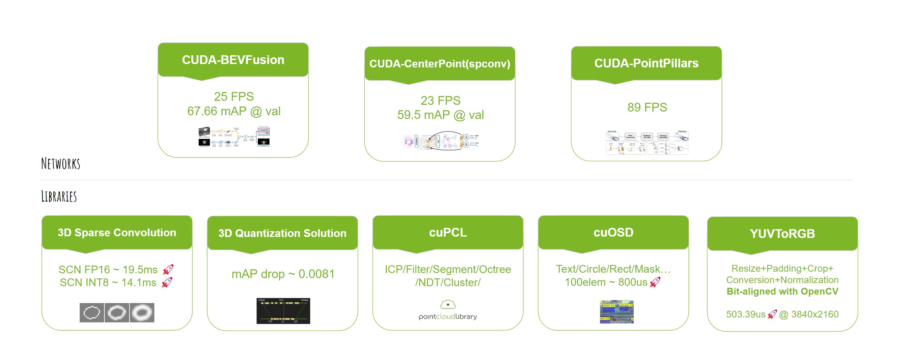
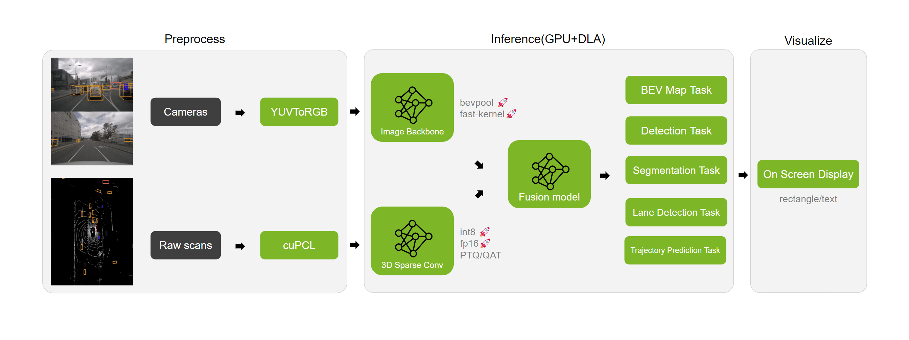

<h1 style="text-align: center">Lidar AI Solution</h1>
This is a highly optimized solution for self-driving 3D-lidar repository.
It does a great job of speeding up sparse convolution/CenterPoint/BEVFusion/OSD/Conversion.



## Pipeline overview


## GetStart
```
$ git clone --recursive https://github.com/NVIDIA-AI-IOT/Lidar_AI_Solution
$ cd Lidar_AI_Solution
```
- For each specific task please refer to the readme in the sub-folder.

## 3D Sparse Convolution
A tiny inference engine for [3d sparse convolutional networks](https://github.com/tianweiy/CenterPoint/blob/master/det3d/models/backbones/scn.py) using int8/fp16.
- **Tiny Engine:** Tiny Lidar-Backbone inference engine independent of TensorRT.
- **Flexible:** Build execution graph from ONNX.
- **Easy To Use:** Simple interface and onnx export solution.
- **High Fidelity:** Low accuracy drop on nuScenes validation.
- **Low Memory:** 422MB@SCN FP16, 426MB@SCN INT8.
- **Compact:** Based on the CUDA kernels and independent of cutlass.

## CUDA BEVFusion
CUDA & TensorRT solution for [BEVFusion](https://arxiv.org/abs/2205.13542) inference, including:
- **Camera Encoder**: ResNet50 and finetuned BEV pooling with TensorRT and onnx export solution.
- **Lidar Encoder**: Tiny Lidar-Backbone inference independent of TensorRT and onnx export solution.
- **Feature Fusion**: Camera & Lidar feature fuser with TensorRT and onnx export solution.
- **Pre/Postprocess**: Interval precomputing, lidar voxelization, feature decoder with CUDA kernels.
- **Easy To Use**: Preparation, inference, evaluation all in one to reproduce torch Impl accuracy.
- **PTQ**: Quantization solutions for [mmdet3d/spconv](https://github.com/mit-han-lab/bevfusion/tree/main/mmdet3d/ops/spconv), Easy to understand.

## CUDA CenterPoint
CUDA & TensorRT solution for [CenterPoint](https://arxiv.org/abs/2006.11275) inference, including:
- **Preprocess**: Voxelization with CUDA kernel
- **Encoder**: 3D backbone with NV spconv-scn and onnx export solution.
- **Neck & Header**: RPN & CenterHead with TensorRT and onnx export solution.
- **Postprocess**: Decode & NMS with CUDA kernel
- **Easy To Use**: Preparation, inference, evaluation all in one to reproduce torch Impl accuracy.
- **QAT**: Quantization solutions for [traveller59/spconv](https://github.com/traveller59/spconv), Easy to understand.

## CUDA PointPillars
CUDA & TensorRT solution for [pointpillars](https://arxiv.org/abs/1812.05784) inference, including:
- **Preprocess**: Voxelization & Feature Extending with CUDA kernel
- **Detector**: 2.5D backbone with TensorRT and onnx export solution.
- **Postprocess**: Parse bounding box, class type and direction
- **Easy To Use**: Preparation, inference, evaluation all in one to reproduce torch Impl accuracy.


## cuOSD(CUDA On-Screen Display Library)
Draw all elements using a single CUDA kernel.
- **Line:** Plotting lines by interpolation(Nearest or Linear).
- **RotateBox:** Supports drawn with different border colors and fill colors.
- **Circle:** Supports drawn with different border colors and fill colors.
- **Rectangle:** Supports drawn with different border colors and fill colors.
- **Text:** Supports [stb_truetype](https://github.com/nothings/stb/blob/master/stb_truetype.h) and [pango-cairo](https://pango.gnome.org/) backends, allowing fonts to be read via TTF or using font-family.
- **Arrow:** Combination of arrows by 3 lines.
- **Point:** Plotting points by interpolation(Nearest or Linear).
- **Clock:** Time plotting based on text support

## cuPCL(CUDA Point Cloud Library)
Provide several GPU accelerated Point Cloud operations with high accuracy and high performance at the same time: cuICP, cuFilter, cuSegmentation, cuOctree, cuCluster, cuNDT, Voxelization(incoming).
- **cuICP:** CUDA accelerated iterative corresponding point vertex cloud(point-to-point) registration implementation.
- **cuFilter:** Support CUDA accelerated features: PassThrough and VoxelGrid.
- **cuSegmentation:** Support CUDA accelerated features: RandomSampleConsensus with a plane model.
- **cuOctree:** Support CUDA accelerated features: Approximate Nearest Search and Radius Search.
- **cuCluster:** Support CUDA accelerated features: Cluster based on the distance among points.
- **cuNDT:** CUDA accelerated 3D Normal Distribution Transform registration implementation for point cloud data.

## YUVToRGB(CUDA Conversion)
YUV to RGB conversion. Combine Resize/Padding/Conversion/Normalization into a single kernel function.
- **Most of the time, it can be bit-aligned with OpenCV.**
    - It will give an exact result when the scaling factor is a rational number.
    - Better performance is usually achieved when the stride can divide by 4.
- Supported Input Format:
    - **NV12BlockLinear**
    - **NV12PitchLinear**
    - **YUV422Packed_YUYV**
- Supported Interpolation methods:
    - **Nearest**
    - **Bilinear**
- Supported Output Data Type:
    - **Uint8**
    - **Float32**
    - **Float16**
- Supported Output Layout:
    - **CHW_RGB/BGR**
    - **HWC_RGB/BGR**
    - **CHW16/32/4/RGB/BGR for DLA input**
- Supported Features:
    - **Resize**
    - **Padding**
    - **Conversion**
    - **Normalization**

## Thanks
This project makes use of a number of awesome open source libraries, including:

- [stb_image](https://github.com/nothings/stb) for PNG and JPEG support
- [pybind11](https://github.com/pybind/pybind11) for seamless C++ / Python interop
- and others! See the dependencies folder.

Many thanks to the authors of these brilliant projects!
