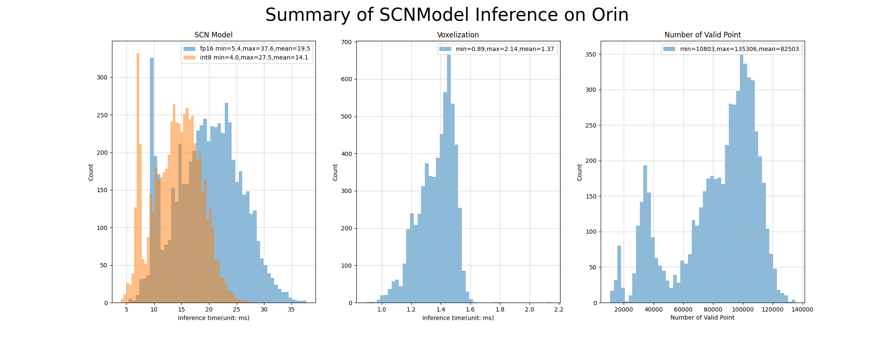

# 3D Sparse Convolution Network
A tiny inference engine for [3d sparse convolutional networks](https://github.com/tianweiy/CenterPoint/blob/master/det3d/models/backbones/scn.py) using int8/fp16.


## News
- (11/14/2025) The libspconv.so 1.3.1 is released now!
  - Add blackwell kernels (for Thor platform).
  - Expose the sortmask functionality to users.
  - Add support for auxiliary stream.
- (05/14/2025) The libspconv.so 1.2.1 is released now!
  - Add support for cudaGraph. Better performance, Better stability.
- (09/11/2024) The libspconv.so 1.1.10 is released now!
  - Add SM90 support for H100 devices.
  - Add a pre-fusion strategy to fix the multi-output bug.
- (10/19/2023) The libspconv.so 1.1.1 is released now!
  - Fix an issue with wrong indices for intermediate output.
- (08/18/2023) The libspconv.so 1.1.0 is released now!
  - Open sourced the onnx parser part. libprotobuf will be configured by yourself.
  - Multiple outputs are supported.

## Model && Data
This demo uses lidar data from [nuScenes Dataset](https://www.nuscenes.org/).
Onnx model can be converted from checkpoint and config below using given script.
|  Dataset  |  Checkpoint  | Config |
| --------- | ------------ | ------ |
|  nuScenes | [epoch_20.pth](https://mitprod-my.sharepoint.com/:f:/g/personal/tianweiy_mit_edu/EhgzjwV2EghOnHFKyRgSadoBr2kUo7yPu52N-I3dG3c5dA?e=a9MdhX) | [nusc_centerpoint_voxelnet_0075voxel_fix_bn_z](https://github.com/tianweiy/CenterPoint/blob/master/configs/nusc/voxelnet/nusc_centerpoint_voxelnet_0075voxel_fix_bn_z.py) |

## Accuracy on nuScenes Validation
|         **Model**        |  **3D Inference** | **Precision** | **mAP** | **NDS** |                   **Description**                  |
|:------------------------:|:-----------------:|:-------------:|:-------:|:-------:|:--------------------------------------------------:|
| centerpoint.scn.PTQ.onnx |     libspconv.so     |      INT8     | 59.15  |  66.45  | PTQ Model, spconv.so INT8 Inference                |
| centerpoint.scn.PTQ.pth | PyTorch FakeQuant |      INT8     |   59.08  |   66.2  | PTQ Model, PyTorch FP16 Inference + FakeQuant-INT8 |
|     [scn.nuscenes.pth](https://github.com/tianweiy/CenterPoint/blob/master/configs/nusc/README.md)     |      PyTorch      |      FP16     |   59.6  |   66.8  | From CenterPoint official, Validation              |
|     centerpoint.scn.onnx    |     libspconv.so     |      FP16     |   59.5  |  66.71  | From CenterPoint official & Inference by spconv.so |

## Memory Usage
|     **Model**     | **Precision** | **Memory** |
|:-----------------:|:-------------:|:----------:|
| centerpoint.scn.PTQ.onnx |      FP16     |    422MB   |
| centerpoint.scn.PTQ.onnx |      INT8     |    426MB   |

## Export ONNX
1. Download and configure the CenterPoint environment from https://github.com/tianweiy/CenterPoint
2. Export SCN ONNX
```
>$ cp -r tool/centerpoint-export path/to/CenterPoint
>$ cd path/to/CenterPoint
>$ python centerpoint-export/export-scn.py --ckpt=epoch_20.pth --save-onnx=scn.nuscenes.onnx
>$ cp scn.nuscenes.onnx path/to/3DSparseConvolution/workspace/
```

3. ## Compile && Run
- Build and run test
```
>$ sudo apt-get install libprotobuf-dev
>$ cd path/to/3DSparseConvolution
->>>>>> modify main.cpp:80 to scn.nuscenes.onnx
>$ CUDA_HOME=/usr/local/cuda SPCONV_USE_CUDAGRAPH=1 SPCONV_CUDA_VERSION=12.8 make fp16 -j
🙌 Output.shape: 1 x 256 x 180 x 180
[PASSED 🤗], libspconv version is 1.0.0
To verify the results, you can execute the following command.
Verify Result:
  python tool/compare.py workspace/centerpoint/out_dense.torch.fp16.tensor workspace/centerpoint/output.zyx.dense --detail
[PASSED].
```

- Verify output
```
>$ python tool/compare.py workspace/centerpoint/out_dense.torch.fp16.tensor workspace/centerpoint/output.zyx.dense --detail
================ Compare Information =================
 CPP     Tensor: 1 x 256 x 180 x 180, float16 : workspace/centerpoint/out_dense.torch.fp16.tensor
 PyTorch Tensor: 1 x 256 x 180 x 180, float16 : workspace/centerpoint/output.zyx.dense
[absdiff]: max:0.19891357421875, sum:1438.463379, std:0.001725, mean:0.000173
CPP:   absmax:3.066406, min:0.000000, std:0.034445, mean:0.003252
Torch: absmax:3.054688, min:0.000000, std:0.034600, mean:0.003279
[absdiff > m75% --- 0.149185]: 0.000 %, 2
[absdiff > m50% --- 0.099457]: 0.000 %, 17
[absdiff > m25% --- 0.049728]: 0.010 %, 846
[absdiff > 0]: 2.140 %, 177539
[absdiff = 0]: 97.860 %, 8116861
[cosine]: 99.876 %
======================================================
```

## For Python
```bash
>$ SPCONV_CUDA_VERSION=11.4 make pyscn -j
Use Python Include: /usr/include/python3.8
Use Python SO Name: python3.8
Use Python Library: /usr/lib
Compile CXX src/pyscn.cpp
Link tool/pyscn.so
You can run "python tool/pytest.py" to test

>$ python tool/pytest.py
[PASSED 🤗].
To verify result:
  python tool/compare.py workspace/centerpoint/out_dense.py.fp16.tensor workspace/centerpoint/out_dense.torch.fp16.tensor --detail
```

## For the infer program
```bash
>$ CUDA_HOME=/usr/local/cuda-12.1 SPCONV_CUDA_VERSION=12.8 make infer
Use spconv_library_path: libspconv/lib/x86_64_cuda12.8
=====================================================================
Load inference task from arguments: bevfusion/bevfusion.scn.xyz.onnx
  onnx: bevfusion/bevfusion.scn.xyz.onnx
  feature: 17748x5 [Float16] : bevfusion/infer.xyz.voxels
  indice: 17748x4 [Int32] : bevfusion/infer.xyz.coors
  grid_size: 1440x1440x41
  fp16: true
  int8: false
  precision: Float16
  sortmask: true
  blackwell: false
  auxiliary_stream: true
  cudagraph: true
  fixed_points: 10000
  profiling: false
  use_dds: false
  verbose: false
  search_best_perf: false
=====================================================================
Run inference task: bevfusion/bevfusion.scn.xyz.onnx
Set DDS num of points (17748) pointer to 0x7f0e0b7fee00
Save output[0] to output0_40.tensor
Done inference task: bevfusion/bevfusion.scn.xyz.onnx
================ Compare Information =================
 CPP     Tensor: 1 x 256 x 180 x 180, float16 : workspace/bevfusion/infer.xyz.dense
 PyTorch Tensor: 1 x 128 x 180 x 180 x 2, float16 : workspace/output0_40.tensor
[absdiff]: max:0.0390625, sum:527.710327, std:0.000441, mean:0.000064
CPP:   absmax:11.164062, min:0.000000, std:0.117200, mean:0.015906
Torch: absmax:11.164062, min:0.000000, std:0.117175, mean:0.015901
[absdiff > m75% --- 0.029297]: 0.000 %, 1
[absdiff > m50% --- 0.019531]: 0.000 %, 14
[absdiff > m25% --- 0.009766]: 0.009 %, 776
[absdiff > 0]: 3.817 %, 316630
[absdiff = 0]: 96.183 %, 7977770
[cosine]: 99.999 %
```

## Performance on ORIN
- Summary performance using 6019 data from nuscenes


## Notes
- The current version supports compute arch are required sm_80, sm_86, and sm_87..
- Supported operators:
  - SparseConvolution, Add, Relu, Add&Relu, ScatterDense, Reshape and ScatterDense&Transpose.
- Supported SparseConvolution:
  - SpatiallySparseConvolution, SparseInverseConvolution, and SubmanifoldSparseConvolution.
- Supported properties of SparseConvolution:
  - activation, kernel_size, dilation, stride, padding, rulebook, subm, output_bound, precision and output_precision.
